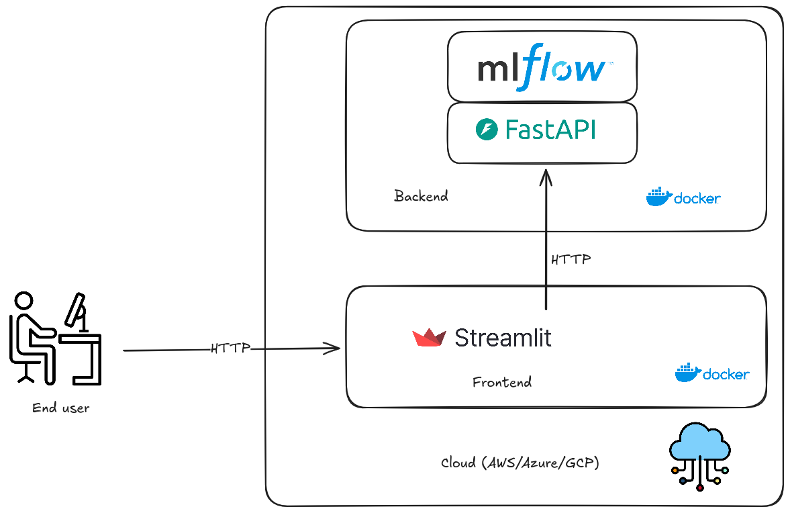
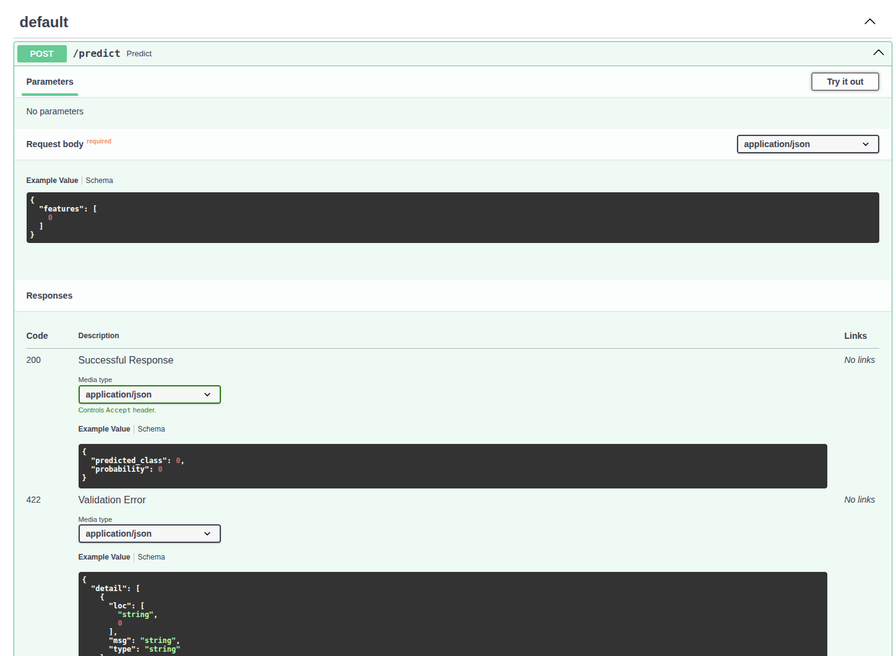
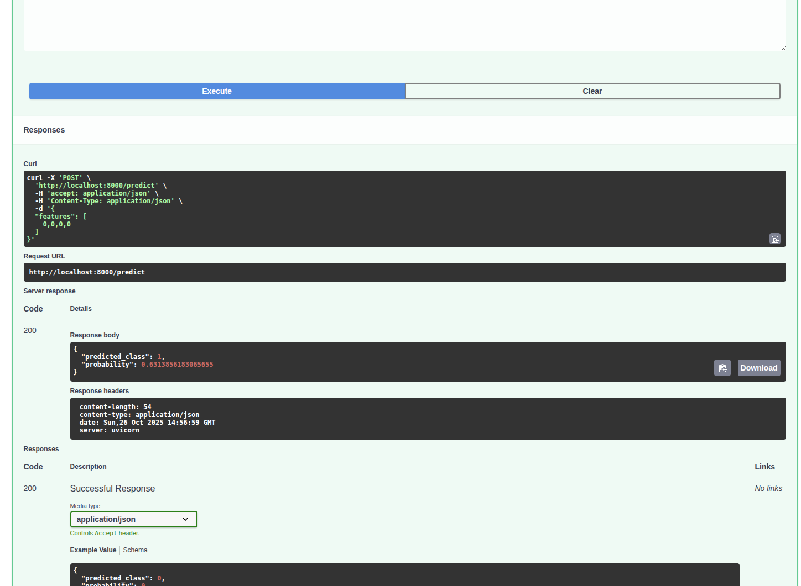
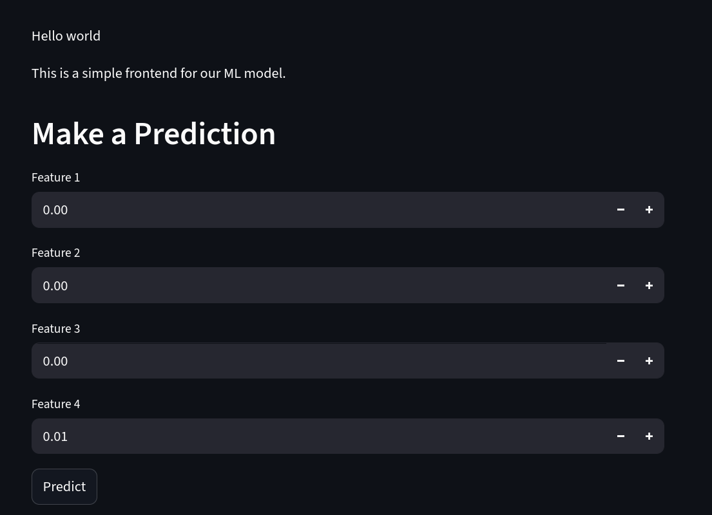
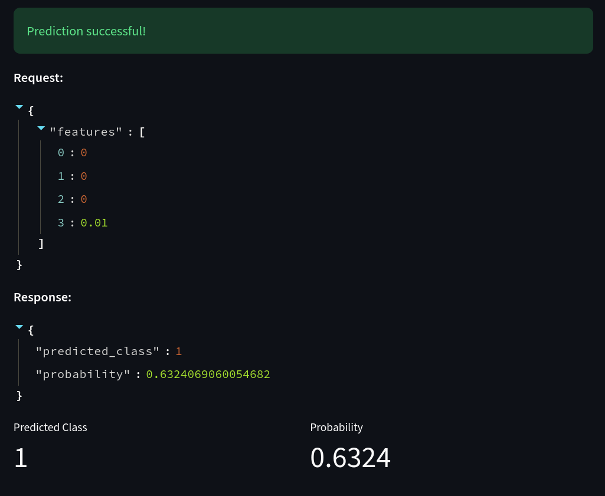

# End to End Practice session for Agile Data Science class

This small project shows a small use case for integrating [MlFlow](https://mlflow.org/), with
FastAPI and streamlit.

The idea is to implement a solution which once deployed to production would look something like this:


## Create a GitHub repository

As seen on class create a new Github Repository

Name it `ub-agile-data-science-e2e`.

Clone the repository locally via the following command:

- note:substitute `${YOUR_USER}` for your username on GitHub (you can copy and paste the URL from GitHub)

```bash
git clone git@github.com:${YOUR_USER}/ub-agile-data-science-e2e.git
```

## Repository structure setup:

With your text editor or your IDE (Visual Studio Code for example) create a folder named `backend` and inside a file `requirements.txt` with:

```
mlflow
fastapi
uvicorn
```

Create a Dockerfile inside the `backend` directory with the following contents:

```
FROM python:3.13

WORKDIR /app

COPY requirements.txt .

RUN pip install -r requirements.txt

COPY . .

CMD ["mlflow", "ui", "--host", "0.0.0.0", "--port", "5000"]
```

Test your Dockerfile via:

```
cd backend
docker build -t ub-agile-data-science-e2e .
docker run -p 5000:5000 ub-agile-data-science-e2e:latest
```

Go to your browser:
http://localhost:5000/

Add, commit and push the requirements.txt file to GitHub.

```bash
git add .
git commit -m "Add initial requirements.txt and initial Dockerfile for backend"
git push
```

## Initial FastAPI endpoint creation

Create a new python file called `app.py` inside the backend directory with the following:

```python
from fastapi import FastAPI

app = FastAPI(title="Minimal MLflow + FastAPI", version="0.1.0")

@app.get("/health")
def health() -> dict:
    return {"status": "ok"}
```

Update the command on your Dockerfile to run the FastAPI application with:

```
CMD ["uvicorn", "app:app", "--host", "0.0.0.0", "--port", "8000"]
```

Test your Dockerfile via:

```
cd backend
docker build -t ub-agile-data-science-e2e .
docker run -p 8000:8000 ub-agile-data-science-e2e:latest
```

Go to your browser:
http://localhost:8000/health
http://localhost:8000/docs

Commit to the repository, the command expects you to be on the backend directory.

```bash
git add app.py Dockerfile
git commit -m "Add initial fastAPI implementation"
git push
```

## Creating a model with mlflow

In order to create our initial model create the `train.py` file inside the backend directory with:

```python
import os
import mlflow.sklearn
from sklearn.datasets import make_classification
from sklearn.linear_model import LogisticRegression
from sklearn.model_selection import train_test_split
from sklearn.metrics import accuracy_score


def main() -> None:

    # Create a tiny toy dataset (4 features)
    X, y = make_classification(
        n_samples=300,
        n_features=4,
        n_informative=3,
        n_redundant=1
    )

    X_train, X_test, y_train, y_test = train_test_split(
        X, y, test_size=0.2, stratify=y
    )

    # Simple, fast model
    model = LogisticRegression(max_iter=500, n_jobs=1)
    model.fit(X_train, y_train)

    # Quick metric
    acc = accuracy_score(y_test, model.predict(X_test))
    print(f"Accuracy: {acc:.3f}")

    # Ensure output directory exists
    out_dir = os.path.abspath(os.path.join(os.path.dirname(__file__), "model"))
    os.makedirs(out_dir, exist_ok=True)

    # Save as an MLflow model (sklearn flavor)
    # This creates `model/MLmodel` plus serialized model artifacts
    mlflow.sklearn.save_model(model, out_dir)
    print(f"Saved MLflow model to: {out_dir}")

    # Also write a tiny README about input expectations
    with open(os.path.join(out_dir, "INPUTS.txt"), "w") as f:
        f.write(
            "Model expects a list of 4 floats per sample (feature vector of length 4).\n"
            "Example request JSON: {\n  \"features\": [0.1, -1.2, 0.3, 2.4]\n}\n"
        )


if __name__ == "__main__":
    main()
```

Build the model executing it in the Docker container with:

```
cd backend
docker build -t ub-agile-data-science-e2e .
docker run -v .:/app ub-agile-data-science-e2e:latest python train.py
```

You should see an output similar to the following:

```
$ docker run -v .:/app ub-agile-data-science-e2e:latest python train.py
Accuracy: 0.933
Saved MLflow model to: /app/model
```

And a new folder `model/` should have been created locally.

Commit to the repository.

```bash
git add train.py
git commit -m "Add initial model training implementation"
git push
```

## Expose the model with FastAPI

Update your `train.py` file and add the following function:

```python
import os
import mlflow.sklearn
import numpy as np
from fastapi import FastAPI, HTTPException
from pydantic import BaseModel
from typing import List


# Paths
BASE_DIR = os.path.abspath(os.path.dirname(__file__))
MODEL_PATH = os.path.join(BASE_DIR, "model")


app = FastAPI(title="Minimal MLflow + FastAPI", version="0.1.0")


class PredictRequest(BaseModel):
    # Feature vector; we'll enforce length=4 in the endpoint to avoid Pydantic version differences
    features: List[float]


class PredictResponse(BaseModel):
    predicted_class: int
    probability: float


@app.on_event("startup")
def load_model() -> None:
    if not os.path.exists(MODEL_PATH):
        raise RuntimeError(
            "Model not found. Run the training script first: python train.py"
        )
    # Load sklearn-flavor model from MLflow directory
    global model
    model = mlflow.sklearn.load_model(MODEL_PATH)

@app.get("/predict", response_model=PredictResponse)
def predict() -> PredictResponse:
    # Convert to shape (1, 4)
    x = np.array([-2, -1, 0, 1], dtype=float).reshape(1, -1)

    try:
        # For classifiers, get both class and probability of positive class (1)
        proba = float(model.predict_proba(x)[0, 1])
        cls = int(model.predict(x)[0])
    except Exception as e:
        raise HTTPException(status_code=400, detail=f"Prediction failed: {e}")

    return PredictResponse(predicted_class=cls, probability=proba)


@app.get("/health")
def health() -> dict:
    return {"status": "ok"}
```

Rebuild your docker image and execute with:
```
docker build -t ub-agile-data-science-e2e .
docker run -v .:/app -p 8000:8000 ub-agile-data-science-e2e:latest
```

Test with:
http://localhost:8000/predict

## Update to POST request

On `train.py` update the predict function to:

```python
@app.post("/predict", response_model=PredictResponse)
def predict(req: PredictRequest) -> PredictResponse:
    # Validate length explicitly (training script uses 4 features)
    if len(req.features) != 4:
        raise HTTPException(status_code=422, detail="Expected 4 features")

    # Convert to shape (1, 4)
    x = np.array(req.features, dtype=float).reshape(1, -1)

    try:
        # For classifiers, get both class and probability of positive class (1)
        proba = float(model.predict_proba(x)[0, 1])
        cls = int(model.predict(x)[0])
    except Exception as e:
        raise HTTPException(status_code=400, detail=f"Prediction failed: {e}")

    return PredictResponse(predicted_class=cls, probability=proba)
```

Rebuild your docker image and execute with:
```
docker build -t ub-agile-data-science-e2e .
docker run -v .:/app -p 8000:8000 ub-agile-data-science-e2e:latest
```

Test with:
http://localhost:8000/predict

It should fail with `Method not Allowed` from the browser, you can test it with any HTTP client that allows you to make :

You can test the POST request directly from the docs, got to the following URL:
http://localhost:8000/docs

Click on **Try it out**:



Edit the value for the list of features to a list of 4:

```
{
  "features": [
    0,0,0,0
  ]
}
```

And check the result:



Check that if the list contains less than 4 values it fails.

Commit to the repository:

```bash
git add app.py
git commit -m "Add initial model training implementation"
git push
```

## Adding a frontend to the picture

Go back to the root folder of the project:

```
cd ..
```

Create a new directory called `frontend` and a `requirements.txt` file with the following content:

```
requests
streamlit
```

Create a `Dockerfile` inside the `frontend` folder with the following contents:

```
FROM python:3.13

WORKDIR /app

COPY requirements.txt .

RUN pip install -r requirements.txt

COPY . .

CMD ["streamlit", "run", "app.py", "--server.address=0.0.0.0", "--server.port=800"]
```

Rebuild your docker image and execute with:
```
docker build -t ub-agile-data-science-frontend .
docker run ub-agile-data-science-frontend:latest
```

The above should fail saying there's no `app.py`. Let's create a file named `app.py` inside frontend:

```
import streamlit as st

st.write("Hello world")
```

Rebuild your docker image and execute with:
```
docker build -t ub-agile-data-science-frontend .
docker run -p 800:800 ub-agile-data-science-frontend:latest
```

Visit:
http://127.0.0.1:800/

## Connecting frontend and Backend

In a real production environment we would be using docker compose or kubernetes to orchestrate our containers.

Due to time / resources constraint we will make our containers communicate directly via de internal docker host.

Update the frontend `app.py` with the following:

```python
import streamlit as st
import requests

st.write("Hello world")
st.write("This is a simple frontend for our ML model.")

st.header("Make a Prediction")
features = []
for i in range(4):
    feature = st.number_input(f"Feature {i+1}", value=0.0)
    features.append(feature)
if st.button("Predict"):
    payload = {"features": features}
    try:
        r = requests.post("http://host.docker.internal:8000/predict", json=payload, timeout=5)
        r.raise_for_status()
        result = r.json()
        
        st.success("Prediction successful!")
        st.write("**Request:**")
        st.json(payload)
        st.write("**Response:**")
        st.json(result)
        
        # Display in a nicer format
        col1, col2 = st.columns(2)
        with col1:
            st.metric("Predicted Class", result["predicted_class"])
        with col2:
            st.metric("Probability", f"{result['probability']:.4f}")
            
    except requests.Timeout:
        st.error("Request timed out - backend may not be running")
    except requests.ConnectionError:
        st.error("Connection failed - make sure backend is running at http://host.docker.internal:8000")
    except requests.RequestException as e:
        st.error(f"Request failed: {e}")
```

Rebuild and run our container:


```
docker build -t ub-agile-data-science-frontend .
```

**On Linux**

```
docker run -p 800:800 --add-host=host.docker.internal:host-gateway ub-agile-data-science-frontend:latest
```

**On macOS / Windows**

```
docker run -p 800:800 ub-agile-data-science-frontend:latest
```



